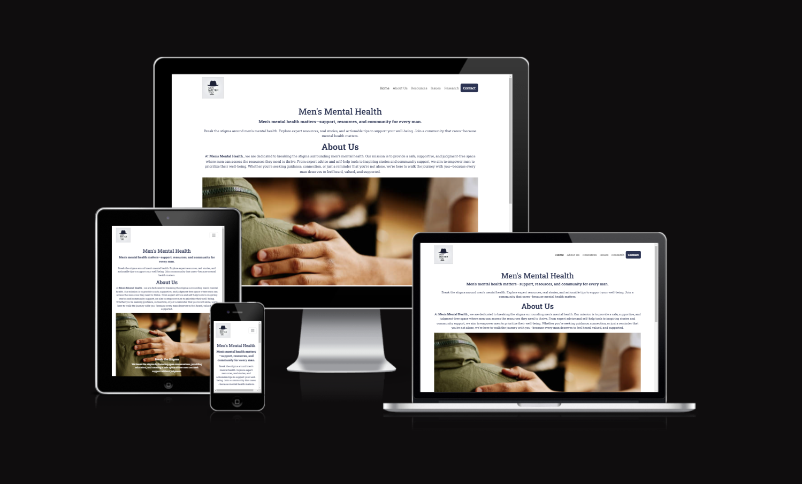
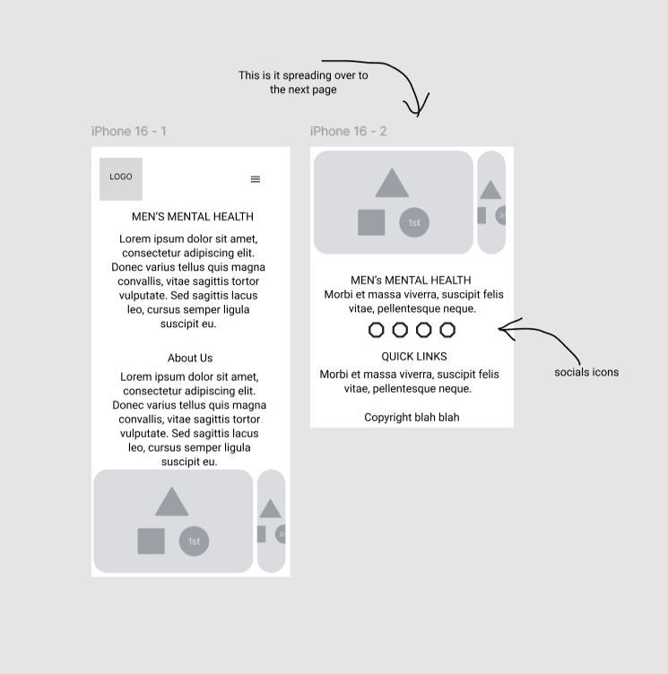
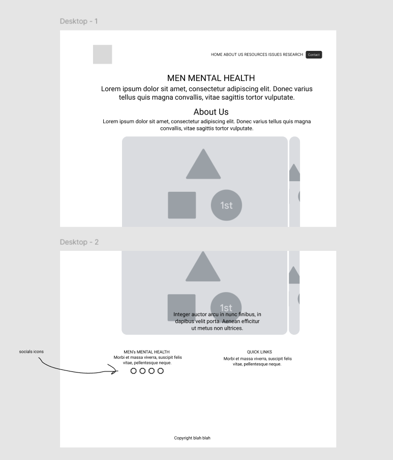
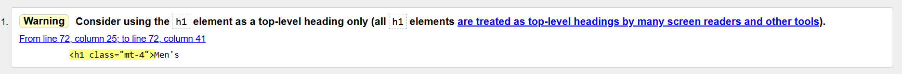

# Men's Mental Health - A Mental Health Awareness Website 

*This image was generated from "https://ui.dev/amiresponsive"*

## Purpose:

The purpose of this website is to raise awareness about men’s mental health, break the stigma surrounding it, and provide resources, support, and education to men and their loved ones. By addressing key issues such as societal expectations, barriers to seeking help, and common mental health challenges, the site aims to create a safe and supportive space where men feel encouraged to prioritise their mental well-being. It also serves as a platform to share personal stories, practical advice, and reliable resources, empowering visitors to take action and foster a more open conversation about mental health.

### Talk about user stories and choice to use the Learning Objectives just as a template and acknowledge the importance of using real stories in a real scenario

For my project board, I chose to use the Learning Objectives stipulated in the LMS to guide my project. Although this approach is not centered around design for a client, it clearly lays out the requirements for this assignment. This method replicated the planning process typically used for user stories without the need to fabricate them. It's important to note that I used the same format you would expect from user stories in order to replicate the planning process.

## AI Reflection:

AI has been used throughout this project, from troubleshooting code with CoPilot to generating content with ChatGPT. 
CoPilot saw its primary use in recreating code that had a prior example, for example it created more cards with different id's based of a card initally created by me.
It is important to note that through the use of ChatGPT generating alot of the content of this page that the contetn itself may be wrong in places or at least bias to the AI's code. However, the upside of this generated content is that the workflow of the page was massively sped up, with vastly increased efficiency.

## Design Choices:

### Multi Page Structure:

Opting for a multiple-page layout (e.g., Home, About Us, Resources, Issues, Research, and Contact) ensures the content is well-organised and easy to navigate. Each section provides users with dedicated spaces to explore specific topics, offering clarity and accessibility. For a subject as nuanced as mental health, this structure helps users find the resources they need without feeling overwhelmed by too much information on a single page. Altough, in hindsight, one page would've been far eaiser and could've been a cleaner experience.

### Minimalist Design:

A minimalist approach over an eccentric or overly decorative style aligns well with the subject matter:

By avoiding unnecessary distractions, the design ensures that the message and resources take center stage.
A clean layout with ample white space makes the content digestible, fostering a calm and focused experience for users.
This simplicity reinforces the site's professional ethos, signaling reliability and trustworthiness to users who may be seeking help.

### Wireframes:

For my wireframes a choose to make them on Figma. Admittably, i should have spent longer on this aspect of the planning, however i was quite eager to get started.
Note that only the Home page is wireframed, again a symptom of my eagerness.

## Mobile:

## Desktop:

### Colour Palette:

The color palette for the website was designed to convey professionalism, trust, and calmness, aligning with the sensitive subject of men’s mental health. Although two highlight colors were defined but not utilised, including them demonstrates good design practice by providing flexibility for future updates or design tweaks.

Primary Color: #2C3453 (Dark Blue)

This color forms the foundation of the design, symbolising stability and trust. It was used for primary text and backgrounds to ensure readability and a professional tone.
Secondary Color: #37379D (Blue)

This slightly lighter blue complements the primary color and is used for headings, links, or subtle accents, creating a cohesive design.
Highlight Color: #6097F5 (Light Blue)

This rich purple was defined as a potential accent for call-to-action buttons or important sections. Purple is often associated with creativity and introspection, making it a fitting choice for mental health themes.
Highlight Color Light: #652D81 (Purple)

### Font:

For the website, two Google Fonts were chosen: Roboto Slab and Roboto Condensed. These fonts were selected to strike a balance between readability and modern design. Roboto Slab, a serif font, was used as the primary font for its clean, professional appearance, ideal for body text and headings that require clarity. Roboto Condensed, a narrower sans-serif font, was chosen as the secondary font to complement the primary font and add versatility, making it suitable for accent text or subheadings.

### Images:

The images used on the website were sourced from a mix of stock image websites and Google Images. Stock images were selected for their professional quality and relevance, while additional visuals from Google Images were chosen to capture specific themes and emotions. 

For any future updates, it is recommended to prioritise images from royalty-free or licensed platforms such as Unsplash, Pexels, or Pixabay to avoid potential copyright issues. Including proper attribution for images, where required, ensures compliance with usage rights and ethical standards.

### Favicon:

The favicon for the website is a cartoon image of a mustache, chosen to symbolically represent masculinity while maintaining a light-hearted and approachable tone. This aligns with the website’s focus on men’s mental health, as the mustache is often associated with campaigns like Movember, which raise awareness about men's health issues.

The favicon was generated using favicon.io.

## Testing and Validation:

Manual tweaks to test responsiveness were performed in browser deployment. W3's validators were also used, as seen below.

### WC3 Validation (HTML & CSS):

 After some tweaks, HTML W3 Validator showed no errors and only one warning (as seen in image) which i have deemed as a not an issue. 
 

 CSS showed no errors.
   

## Github:

The project was initially built using the Code Institute Full Template. The repository is hosted on GitHub, aswell as the project board.

### Deployment:
 
 The website is also deployed directly from the Main branch of the GitHub repository, ensuring seamless updates and easy accessibility for users.

 Live link: https://ewanw1lls.github.io/Mental-Health-Awareness/

## Project Status:

WIP - Research page still in progress.

Some bug fixes and small fixes still in progress see to-do

### To-Do List:

- [ ] image res on home page
- [ ] image resizing on home page carousel
- [ ] add dark mode (too much effort for rn)
- [ ] finish research page

### Final Thoughts/Reflection:

This project was really useful in understanding everything that we've learnt throughout the first month and a bit of this course.
Hoever the project has to come to an end.